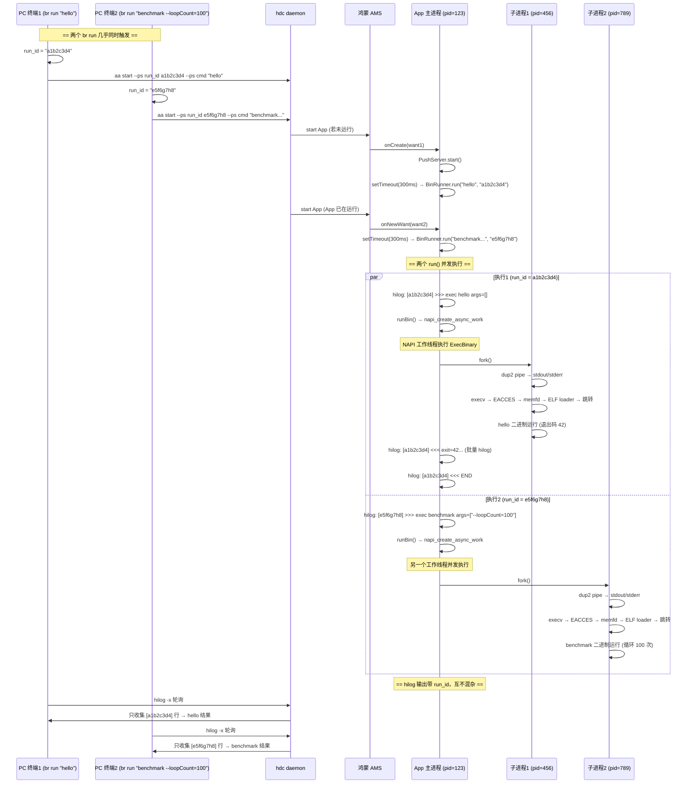

# 多终端并发执行规格说明

## 概述

BinRunner 支持多个 `br` 终端（或 hdc shell 会话）同时向同一台手机的 App 实例发起命令，各次执行相互隔离、互不干扰。

## 并发模型

```
PC终端1 ──hdc──┐                    ┌── fork() → 子进程 456 (hello, 2ms)
               │                    │
PC终端2 ──hdc──┤──── App 主进程 ────┤
               │    (pid=123)       │
PC终端3 ──hdc──┘                    └── fork() → 子进程 789 (benchmark, 30s)
```

每条 `br run` 是一条独立的 **执行会话**，核心特征：

| 维度 | 说明 |
|---|---|
| **触发方式** | `aa start` 通过 AMS 调用 App 的 `onCreate`/`onNewWant` |
| **执行载体** | 每个会话 fork 一个独立子进程，各自运行目标二进制 |
| **进程隔离** | 子进程之间完全独立（各自 fork、各自 pipe、各自地址空间） |
| **输出隔离** | 每条会话生成唯一的 8 位 hex **run_id**，所有 hilog 输出带 `[run_id]` 前缀 |
| **结果收集** | CLI 侧 hilog 轮询时只认自己的 run_id，忽略其他会话的输出 |
| **状态冲突** | 无 — 各会话无共享状态（App 主进程仅做路由，不持有会话数据） |

## 时序图



## run_id 机制

### 生成

CLI 侧每次 `cmd_run` 生成随机 8 位 hex 字符串：

```python
run_id = ''.join(random.choices('0123456789abcdef', k=8))
# → "a1b2c3d4"
```

碰撞概率：`16^8 ≈ 43 亿`，实际并发场景（同一手机 2-3 个终端）下可忽略。

### 传递

通过 `aa start` 的 `--ps` 参数传给设备端：

```bash
aa start -b com.example.binrunner -a EntryAbility \
  --ps run_id a1b2c3d4 --ps cmd "hello foo bar"
```

设备端 `EntryAbility.onCreate` / `onNewWant` 从 `want.parameters.run_id` 提取。

### 标记

ArkTS 层所有 BinRunner hilog 输出均带 `[run_id]` 前缀：

```
BinRunner: [a1b2c3d4] >>> exec hello args=["foo","bar"]
BinRunner: [a1b2c3d4] <<< exit=42 timedOut=false
BinRunner: [a1b2c3d4] <<< --- stdout ---
BinRunner: [a1b2c3d4] <<< hello from bundled binary!
BinRunner: [a1b2c3d4] <<< --- stderr ---
BinRunner: [a1b2c3d4] <<< this line goes to stderr
BinRunner: [a1b2c3d4] <<< END
```

### 过滤

CLI 侧 `_parse_hilog_output` 在 run_id 非空时过滤输出，剥离前缀后走原有解析逻辑：

```python
id_marker = f"[{run_id}] "  # "[a1b2c3d4] "
for line in output:
    if id_marker and not body.startswith(id_marker):
        continue  # 跳过其他会话的输出
    body = body[len(id_marker):]  # 剥离前缀
    # ... 继续原有解析
```

### 兼容

`run_id` 为空串时不过滤，处理所有 BinRunner 行：

- 手动 `aa start` 不传 `--ps run_id` → App 侧 `runId` 为空 → 无前缀 → CLI `id_marker` 为空 → 不过滤
- `br logs` 不传 run_id → 显示所有会话的输出

## PushServer 并发

PushServer（TCP :8888）同样支持多客户端并发：

| 维度 | 说明 |
|---|---|
| 连接模型 | 每个 `br push` 建立独立 TCP 连接，单连接单文件 |
| 并发安全 | `socket.constructTCPSocketServerInstance()` 内部并发的 `connect` 事件各自独立处理 |
| 文件冲突 | 同名文件后写覆盖先写（无锁），不报错，静默覆盖 |
| 目录创建 | `fileIo.mkdirSync(parentDir, true)` 幂等，重复创建不报错 |

**不影响执行隔离**：PushServer 只负责文件推送，与二进制执行（run_id 机制）完全独立。推送的文件对所有后续执行可见，但不影响已在运行的子进程。

## 限制

| 项 | 说明 |
|---|---|
| 输出性能 | 所有会话共用 hilog 通道，极端并发下可能触发 socket 溢出（批量合并已大幅缓解） |
| 内存 | 每个子进程独立 fork + 匿名内存映射 ELF，内存占用与并发数线性增长 |
| CPU | 多个二进制同时运行共享手机 CPU，无优先级调度 |
| 最大并发 | 受限于 App 进程的 fd/内存/线程上限，实际场景远低于硬限制 |

## 实现文件

| 文件 | 职责 |
|---|---|
| [binrunner](../binrunner) | run_id 生成、传递、hilog 过滤 |
| [entry/src/main/ets/entryability/EntryAbility.ets](../entry/src/main/ets/entryability/EntryAbility.ets) | run_id 提取与传递 |
| [entry/src/main/ets/common/BinRunner.ets](../entry/src/main/ets/common/BinRunner.ets) | run_id 前缀注入、logLines 前缀传递 |
| [entry/src/main/ets/common/PushServer.ets](../entry/src/main/ets/common/PushServer.ets) | TCP 多连接并发处理 |
| [entry/src/main/cpp/napi_init.cpp](../entry/src/main/cpp/napi_init.cpp) | napi_create_async_work 工作线程执行 |
